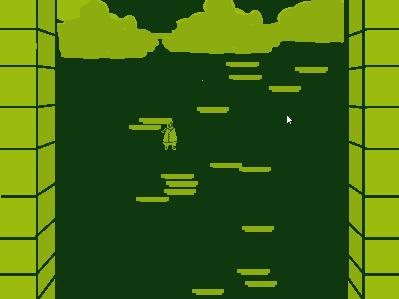
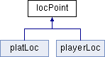

# Space Jump SFML Game
Space Jump SFML Game is a vertical jumping game base on sfml library wrote by me with researchable resource from the SFML offical website. 
I made it mainly during November, I think I'm still in the entry level for C++ coding. 
This project is for the class final project. 
Class is COP 3003, I made this project mainly at home. 

## Demonstration
 

## Documentation
[Doxygen](https://nizisi.github.io/Projects-3003/html/)

## Diagrams

## Getting Started

## Built With

## Contributing

## Author

## License

## Acknowledgments

## History

## Key Programming Concepts Utilized

